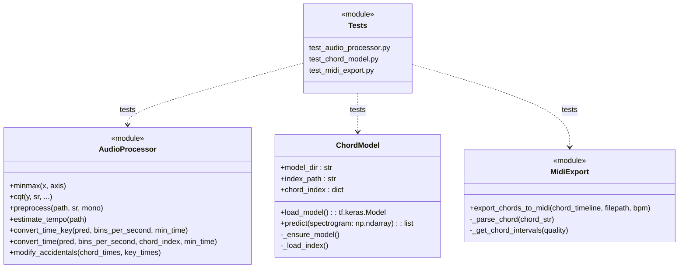

# クラス図 (AI Chord Tracker)

```mermaid
classDiagram
    class ChordModel {
        +model_dir : str
        +index_path : str
        +chord_index : dict
        +load_model() : tf.keras.Model
        +predict(spectrogram: np.ndarray) : list
        -_ensure_model()
        -_load_index()
    }
    
    class AudioProcessor {
        <<module>>
        +minmax(x, axis)
        +cqt(y, sr, ...)
        +preprocess(path, sr, mono)
        +estimate_tempo(path)
        +convert_time_key(pred, bins_per_second, min_time)
        +convert_time(pred, bins_per_second, chord_index, min_time)
        +modify_accidentals(chord_times, key_times)
    }
    
    class MidiExport {
        <<module>>
        +export_chords_to_midi(chord_timeline, filepath, bpm)
        -_parse_chord(chord_str)
        -_get_chord_intervals(quality)
    }

    class Tests {
        <<module>>
        test_audio_processor.py
        test_chord_model.py
        test_midi_export.py
    }

    Tests ..> AudioProcessor : tests
    Tests ..> ChordModel : tests
    Tests ..> MidiExport : tests
```
