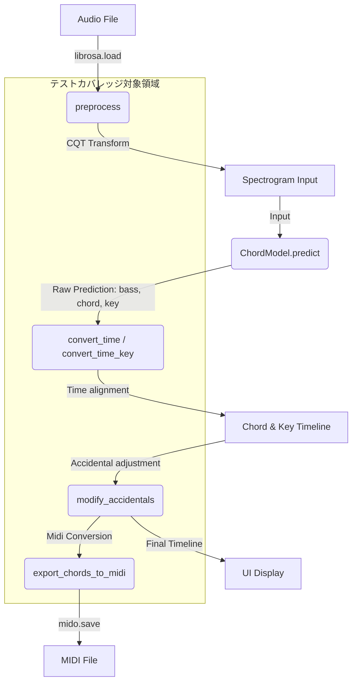

# データフロー図 (AI Chord Tracker)

```mermaid
graph TD
    A[Audio File] -->|librosa.load| B(preprocess)
    B -->|CQT Transform| C[Spectrogram Input]
    C -->|Input| D(ChordModel.predict)
    D -->|Raw Prediction: bass, chord, key| E(convert_time / convert_time_key)
    E -->|Time alignment| F[Chord & Key Timeline]
    F -->|Accidental adjustment| G(modify_accidentals)
    G -->|Final Timeline| H[UI Display]
    G -->|Midi Conversion| I(export_chords_to_midi)
    I -->|mido.save| J[MIDI File]
    
    subgraph テストカバレッジ対象領域
    B
    E
    G
    I
    end
```
